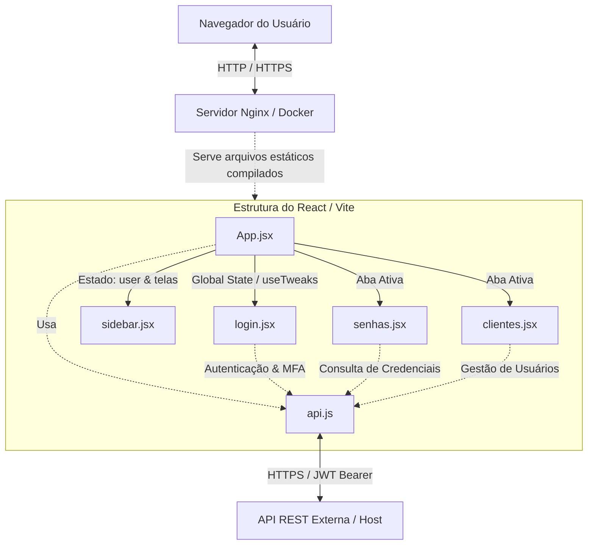

# Portal do Cliente - Contabilize Seguro

Este repositório contém a **Central do Cliente (Front-end)** da Contabilize Seguro. A aplicação é uma Single Page Application (SPA) reativa desenvolvida para garantir o gerenciamento seguro e simplificado de credenciais de seguradoras parceiras, em conformidade com a LGPD e as regulamentações da SUSEP.

O guia de uso para usuários finais está disponível no arquivo [README.html](file:///c:/contabilize-seguro/web-app-cliente/README.html).

---

## 🏗️ Arquitetura da Aplicação

A aplicação segue uma arquitetura moderna baseada em componentes desacoplados, comunicação orientada a serviços (APIs REST) e estilização flexível para suporte a co-branding/white-label.



### 1. Pilha de Tecnologia (Tech Stack)
* **Core:** React 19 (Hooks, Contexts, Refs) e Vite 8 (Build System ultrarrápido com ESM).
* **Estilização (CSS):** Vanilla CSS robusto e flexível (baseado nos arquivos [styles.css](file:///c:/contabilize-seguro/web-app-cliente/src/styles.css) e [App.css](file:///c:/contabilize-seguro/web-app-cliente/src/App.css)). Utiliza CSS Custom Properties (`--brand-primary`, `--brand-primary-deep`, `--brand-bg-panel`, `--gold`, etc.) para renderização dinâmica de temas.
* **Build & Deploy:** Dockerfile multi-stage e Nginx Alpine configurado para roteamento SPA e compressão estática.

### 2. Estrutura de Diretórios
Abaixo está a disposição dos arquivos fundamentais do projeto:

* **[src/main.jsx](file:///c:/contabilize-seguro/web-app-cliente/src/main.jsx):** Ponto de entrada da aplicação React.
* **[src/App.jsx](file:///c:/contabilize-seguro/web-app-cliente/src/App.jsx):** Componente root que gerencia o estado global (sessão do usuário, permissões das telas, abas ativas) e os tweaks visuais de desenvolvimento.
* **[src/components/](file:///c:/contabilize-seguro/web-app-cliente/src/components):**
  * [login.jsx](file:///c:/contabilize-seguro/web-app-cliente/src/components/login.jsx): Controla o fluxo de login corporativo, validação em tempo real de e-mails pessoais, painel de MFA com inputs de OTP (One-Time Password) de 6 dígitos inteligente e fluxo de redefinição de senha com indicador de força (entropia).
  * [senhas.jsx](file:///c:/contabilize-seguro/web-app-cliente/src/components/senhas.jsx): Dashboard principal com listagem de credenciais, filtros por categorias de seguradoras, busca reativa e opções de visualização (Tabela, Cards, Lista).
  * [clientes.jsx](file:///c:/contabilize-seguro/web-app-cliente/src/components/clientes.jsx): Tela administrativa de gestão de usuários de corretoras.
  * [sidebar.jsx](file:///c:/contabilize-seguro/web-app-cliente/src/components/sidebar.jsx): Painel de navegação lateral baseado nos perfis de acesso.
  * [tweaks-panel.jsx](file:///c:/contabilize-seguro/web-app-cliente/src/components/tweaks-panel.jsx): Painel flutuante de customização rápida de temas para demonstrações.
* **[src/utils/api.js](file:///c:/contabilize-seguro/web-app-cliente/src/utils/api.js):** Utilitários de comunicação HTTP baseados na Fetch API.
  * Injeta dinamicamente tokens JWT (`Bearer token`) nas requisições.
  * Implementa interceptador global para status **401 (Não Autorizado)** que realiza o logout automático do usuário e limpa o localStorage.
  * Trata quedas de conexão de rede de maneira amigável ao usuário.

### 3. Autenticação e Controle de Acesso (Auth & RBAC)
* **Sessão Persistente:** O token de autenticação é salvo no `localStorage` sob a chave `auth_token`. Na inicialização do app, as claims do JWT são decodificadas para restaurar as informações básicas do usuário.
* **RBAC baseado em Telas:** Logo após o login ou restauração de sessão, o app consulta o endpoint `/ControleAcesso/usuarios/{userId}/telas-acessiveis`. Os códigos retornados (ex: `geren_seguros`, `geren_usuarios`) controlam dinamicamente a visibilidade das abas e opções do menu lateral (`Sidebar`).

---

## 🚀 Passo a Passo para Inicializar o Projeto

### Pré-requisitos
Certifique-se de possuir instalado em sua máquina:
1. **Node.js** (versão 20.x ou superior recomendada).
2. **NPM** (instalado junto com o Node.js).

---

### 💻 Desenvolvimento Local

Siga as etapas abaixo para clonar, instalar as dependências e rodar o projeto localmente:

1. **Acessar a pasta do projeto:**
   ```bash
   cd c:\contabilize-seguro\web-app-cliente
   ```

2. **Instalar as dependências:**
   ```bash
   npm install
   ```

3. **Iniciar o servidor de desenvolvimento local:**
   ```bash
   npm run dev
   ```
   > 💡 O Vite inicializará a aplicação. Acesse pelo navegador em: [http://localhost:5173](http://localhost:5173)

4. **Rodar o Linter (Análise estática de código):**
   ```bash
   npm run lint
   ```

5. **Gerar e pré-visualizar o build de produção localmente:**
   ```bash
   npm run build
   npm run preview
   ```

---

### 🐳 Execução via Docker (Produção)

A aplicação está pronta para ser empacotada em um contêiner Docker rodando Nginx otimizado.

1. **Construir a imagem Docker:**
   ```bash
   docker build -t contabilize-web-app:latest .
   ```

2. **Iniciar o contêiner exposto na porta 80:**
   ```bash
   docker run -d -p 80:80 --name contabilize-portal contabilize-web-app:latest
   ```
   > 🌐 Acesse a aplicação em: [http://localhost](http://localhost)

3. **Verificar a integridade (Healthcheck):**
   O contêiner possui um healthcheck interno configurado. Execute o comando abaixo para verificar o status de saúde:
   ```bash
   docker ps --filter name=contabilize-portal
   ```

---

## 🔒 Configurações do Nginx em Produção

O arquivo [nginx.conf](file:///c:/contabilize-seguro/web-app-cliente/nginx.conf) configura as seguintes melhorias para o ambiente de produção:
* **SPA Routing Fallback:** Qualquer rota desconhecida é enviada para o `index.html` (`try_files $uri $uri/ /index.html;`), delegando o roteamento para a aplicação React.
* **Gzip Compression:** Compressão habilitada para otimizar o tempo de carregamento de assets HTML, CSS, JavaScript, JSON e SVGs.
* **Cachê Estratégico:**
  * Arquivos estáticos (imagens, CSS, JS compilados, fontes) recebem cache imutável de **30 dias**.
  * Arquivos HTML recebem cabeçalhos de controle que forçam a validação (`no-cache, must-revalidate`), garantindo que o usuário sempre receba a versão mais recente após uma atualização.
* **Cabeçalhos de Segurança:** Inclusão de `X-Content-Type-Options`, `X-Frame-Options` e `Referrer-Policy`.
